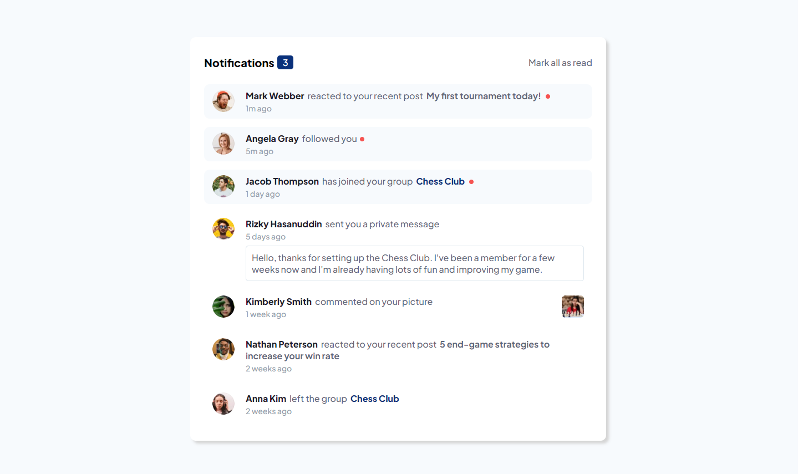
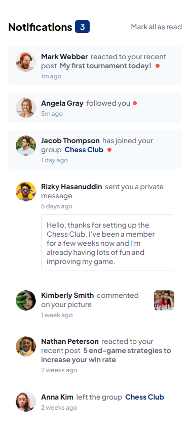

# Frontend Mentor - Notifications page solution

This is a solution to the [Notifications page challenge on Frontend Mentor](https://www.frontendmentor.io/challenges/notifications-page-DqK5QAmKbC). Frontend Mentor challenges help you improve your coding skills by building realistic projects. 

## Table of contents

- [Overview](#overview)
  - [The challenge](#the-challenge)
  - [Screenshot](#screenshot)
  - [Links](#links)
- [My process](#my-process)
  - [Built with](#built-with)
  - [What I learned](#what-i-learned)
- [Author](#author)
- [Acknowledgments](#acknowledgments)

## Overview

### The challenge

Users should be able to:

- Distinguish between "unread" and "read" notifications
- Select "Mark all as read" to toggle the visual state of the unread notifications and set the number of unread messages to zero
- View the optimal layout for the interface depending on their device's screen size
- See hover and focus states for all interactive elements on the page

### Screenshot

## Desktop Design

## Mobile Design

### Links

- Live Site URL: [Notifications Page](https://rkendall300.github.io/notifications-page/)

## My process

### Built with

- Semantic HTML5 markup
- CSS custom properties
- Flexbox
- Mobile-first workflow
- [React](https://reactjs.org/) - JS library

### What I learned

This project was a little tricky getting all the different areas set up, but overall not too bad. I added a small bit of functionality to make the notification number at the top change depending on how many are still unread. I'm very happy with how the final product turned out.

## Author

- Frontend Mentor - [@rkendall300](https://www.frontendmentor.io/profile/rkendall300)

## Acknowledgments

Shout out to my friend Eric for motivating me to get the higher level Frontend Mentor projects going!
